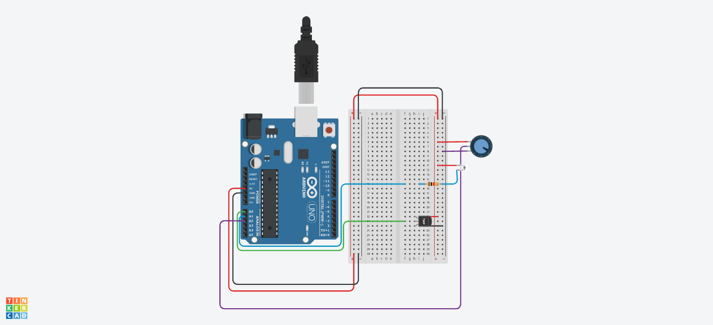

# AmbientSense (MVP)

Visão rápida do fluxo **Tinkercad (firmware simulado)** → **backend Java (mock por arquivo)** → **API REST** para dashboard.

## Hardware simulado (Tinkercad)

O circuito e o sketch estão montados no **Tinkercad Circuits** (Arduino UNO). Leituras periódicas de temperatura (TMP36), luminosidade (fototransistor) e umidade simulada (potenciômetro); saída no monitor serial em **9600 baud**, **uma linha JSON por amostra** (mesmo contrato usado no backend).



Detalhes do sketch e pinos: `arduino-simulation/README.md`.

## O que é o “mock” no backend

Em vez de receber serial na hora da demo, o servidor **lê um arquivo JSON Lines** (uma linha = um objeto JSON igual ao do Arduino) e avança linha a linha em intervalos fixos — **simula a cadência** do firmware.

| Ideia          | Detalhe                                                        |
| -------------- | -------------------------------------------------------------- |
| Fonte padrão   | `backend-java/data/sample-output.jsonl`                        |
| Ritmo          | `ambientsense.mock.tick-ms` (ex.: 1000 ms entre linhas)        |
| Fim do arquivo | Modo `RESTART` refaz o arquivo em loop; `STOP` para de avançar |

Subir o servidor (na pasta `backend-java/`):

```bash
mvn spring-boot:run
```

Aguarde pelo menos um “tick” para existir leitura em `/samples/current`. Documentação mais completa: `docs/integration-mvp-backend.md`.

## Endpoints REST (base `http://localhost:8080/api/v1`)

| Método | Caminho                    | Uso                                                                           |
| ------ | -------------------------- | ----------------------------------------------------------------------------- |
| GET    | `/samples/current`         | Última amostra processada + alertas dessa leitura                             |
| GET    | `/samples/recent?limit=64` | Histórico recente (limite entre 1 e 500)                                      |
| GET    | `/integration/state`       | Estado do mock: arquivo usado, total de linhas, índice atual, se parou no EOF |

CORS liberado para `GET`/`OPTIONS` em `/api/**` no MVP (ambiente local).

---

_O Tinkercad mostra o comportamento físico; o mock reproduz esse fluxo de dados via arquivo para integração estável com a API durante a apresentação._
