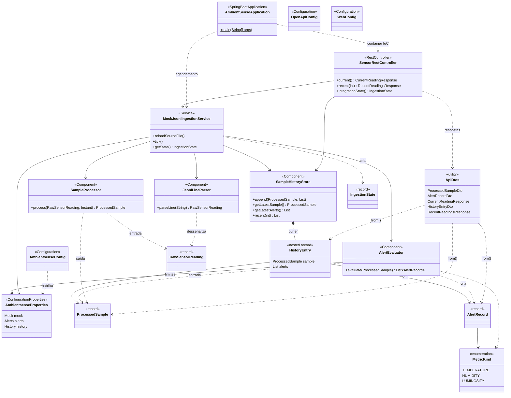

# AmbientSense — Backend Java (MVP)

API REST em Spring Boot que ingere leituras mock (arquivo **JSON Lines**), processa validações, aplica **limites configuráveis** e expõe leituras e alertas para o dashboard.

## Estrutura do módulo

| Caminho | Função |
|---------|--------|
| `src/main/java/com/ambientsense/` | Aplicação, configuração (`config/`), modelos de domínio (`model/`), serviços (`service/`), controllers REST (`web/`) |
| `src/main/resources/application.yml` | Porta, mock JSONL, **limites de alerta**, SpringDoc |
| `data/sample-output.jsonl` | Fonte mock (uma linha JSON por leitura); ver também `../docs/guide.md` seção 8 |

## Diagrama de classes (UML)

Visão dos principais componentes do backend, fluxo de ingestão mock (JSONL) e exposição REST. Relações de **dependência** (uso) e **composição** (histórico) estão indicadas; DTOs de API espelham os registros de domínio na camada `web`.



Execução (a partir desta pasta):

```bash
mvn spring-boot:run
```

- **Swagger UI:** [http://localhost:8080/](http://localhost:8080/) (redireciona para o Swagger)
- **OpenAPI JSON:** `http://localhost:8080/v3/api-docs`

---

## Endpoints (todos GET, JSON)

Base: `http://localhost:8080/api/v1`

| Caminho | Parâmetros | Descrição |
|---------|------------|-----------|
| `/samples/current` | — | Última amostra processada + lista de alertas dessa leitura |
| `/samples/recent` | `limit` (opcional, padrão `64`, máx. `500`) | Histórico: cada item é `{ sample, alerts }` |
| `/integration/state` | — | Estado do mock: arquivo resolvido, total de linhas, cursor, EOF |

---

## Modelos de resposta JSON

### `GET /api/v1/samples/current`

Envelope `CurrentReadingResponse`:

| Campo | Tipo | Descrição |
|-------|------|-----------|
| `sample` | objeto ou `null` | Última amostra; `null` antes da primeira ingestão ou se não houver dados |
| `alerts` | array | Alertas gerados para **essa** amostra (pode ser `[]`) |

**Exemplo (com leitura e sem alertas):**

```json
{
  "sample": {
    "timestampMillis": 9000,
    "serverReceivedAt": "2026-04-07T12:00:00.123456Z",
    "temperatureC": 24.18,
    "humidityPercent": 48.19,
    "luminosityPercent": 28.0,
    "deviceId": "ambient-sense-01",
    "valid": true,
    "validationNotes": []
  },
  "alerts": []
}
```

**Exemplo (ainda sem nenhuma leitura ingerida):**

```json
{
  "sample": null,
  "alerts": []
}
```

### Objeto `sample` (`ProcessedSampleDto`)

| Campo | Tipo | Descrição |
|-------|------|-----------|
| `timestampMillis` | number | `millis()` da origem (Arduino / contrato Etapa 1) |
| `serverReceivedAt` | string (ISO-8601) ou `null` | Instant em que o servidor processou a linha |
| `temperatureC` | number | °C |
| `humidityPercent` | number | 0–100 |
| `luminosityPercent` | number | 0–100 (mapeamento do ADC no firmware) |
| `deviceId` | string | Identificador do nó |
| `valid` | boolean | `false` se faltar campo ou faixa inválida na validação |
| `validationNotes` | array de strings | Motivos de invalidação (ex.: umidade fora de 0–100) |

### `GET /api/v1/samples/recent?limit=64`

Envelope `RecentReadingsResponse`:

```json
{
  "entries": [
    {
      "sample": { },
      "alerts": [ ]
    }
  ]
}
```

Cada elemento de `entries` tem a mesma forma lógica que `/samples/current` (um `sample` + seus `alerts` naquele instante).

### `GET /api/v1/integration/state`

Objeto `IngestionState`:

| Campo | Tipo | Descrição |
|-------|------|-----------|
| `lineIndex` | number | Próxima linha a ler / progresso (após avanços do agendador) |
| `totalLines` | number | Linhas não vazias carregadas do JSONL |
| `sourceReady` | boolean | Arquivo carregado com pelo menos uma linha |
| `stoppedAtEof` | boolean | `true` se `on-eof: STOP` e o arquivo terminou |
| `jsonlPathResolved` | string | Caminho absoluto do arquivo em uso |

**Exemplo:**

```json
{
  "lineIndex": 12,
  "totalLines": 65,
  "sourceReady": true,
  "stoppedAtEof": false,
  "jsonlPathResolved": "/.../backend-java/data/sample-output.jsonl"
}
```

---

## Alertas: regras e formato JSON

Os limites vêm de `application.yml` em `ambientsense.alerts`:

- `temperature-c` → `min` / `max` (°C)
- `humidity-percent` → `min` / `max` (%)
- `luminosity-percent` → `min` / `max` (%)

Valores **padrão atuais** no repositório:

```yaml
temperature-c:      min: 18.0, max: 30.0
humidity-percent:     min: 20.0, max: 80.0
luminosity-percent:   min: 0.0,  max: 100.0
```

Para **luminosidade**, `0` e `100` como extremos fazem com que alertas de “fora da faixa” praticamente não ocorram em dados válidos; ajuste `min`/`max` (ex.: `min: 15`, `max: 85`) se quiser alertas de ambiente escuro/claro na demo.

### Objeto de alerta (`AlertRecordDto`)

Todo alerta retornado na API segue este formato:

| Campo | Tipo | Descrição |
|-------|------|-----------|
| `severity` | string | Hoje sempre `"WARN"` no MVP |
| `message` | string | Texto em português (abaixo/above do limite) |
| `triggeredAt` | string ISO-8601 | Mesmo instante base da amostra (`serverReceivedAt`) |
| `metric` | string | Um de: `"TEMPERATURE"`, `"HUMIDITY"`, `"LUMINOSITY"` |
| `observedValue` | number | Valor medido que violou a regra |
| `limitMin` | number ou `null` | Limite inferior configurado |
| `limitMax` | number ou `null` | Limite superior configurado |

**Possíveis cenários (6 tipos lógicos):** para cada métrica há até **dois** alertas por leitura — valor **abaixo de `min`** ou **acima de `max`**. Não há alerta se o valor estiver dentro da faixa `[min, max]` (limites inclusivos no comparador: `value < min` ou `value > max`).

### Exemplos de JSON por tipo de violação

**1. Temperatura abaixo do mínimo** (`metric`: `TEMPERATURE`, `observedValue` < `limitMin`)

```json
{
  "severity": "WARN",
  "message": "TEMPERATURE abaixo do mínimo configurado",
  "triggeredAt": "2026-04-07T12:00:01.000Z",
  "metric": "TEMPERATURE",
  "observedValue": 17.2,
  "limitMin": 18.0,
  "limitMax": 30.0
}
```

**2. Temperatura acima do máximo**

```json
{
  "severity": "WARN",
  "message": "TEMPERATURE acima do máximo configurado",
  "triggeredAt": "2026-04-07T12:00:02.000Z",
  "metric": "TEMPERATURE",
  "observedValue": 31.5,
  "limitMin": 18.0,
  "limitMax": 30.0
}
```

**3. Umidade abaixo do mínimo** (“umidade baixa”)

```json
{
  "severity": "WARN",
  "message": "HUMIDITY abaixo do mínimo configurado",
  "triggeredAt": "2026-04-07T12:00:03.000Z",
  "metric": "HUMIDITY",
  "observedValue": 15.0,
  "limitMin": 20.0,
  "limitMax": 80.0
}
```

**4. Umidade acima do máximo** (“umidade alta”)

```json
{
  "severity": "WARN",
  "message": "HUMIDITY acima do máximo configurado",
  "triggeredAt": "2026-04-07T12:00:04.000Z",
  "metric": "HUMIDITY",
  "observedValue": 82.0,
  "limitMin": 20.0,
  "limitMax": 80.0
}
```

**5. Luminosidade abaixo do mínimo** (“ambiente escuro” — requer `limitMin` > 0 na config)

```json
{
  "severity": "WARN",
  "message": "LUMINOSITY abaixo do mínimo configurado",
  "triggeredAt": "2026-04-07T12:00:05.000Z",
  "metric": "LUMINOSITY",
  "observedValue": 8.0,
  "limitMin": 15.0,
  "limitMax": 85.0
}
```

**6. Luminosidade acima do máximo** (“muito claro” — requer `limitMax` < 100 na config)

```json
{
  "severity": "WARN",
  "message": "LUMINOSITY acima do máximo configurado",
  "triggeredAt": "2026-04-07T12:00:06.000Z",
  "metric": "LUMINOSITY",
  "observedValue": 92.0,
  "limitMin": 15.0,
  "limitMax": 85.0
}
```

Uma mesma leitura pode retornar **vários** objetos no array `alerts` se mais de uma métrica violar limites ao mesmo tempo.

---

## Referências

- Contrato da linha JSONL (entrada): `../docs/guide.md` (seção 8)
- Integração MVP (arquivo, UTF-8, `tick-ms`, EOF): `../docs/integration-mvp-backend.md`
