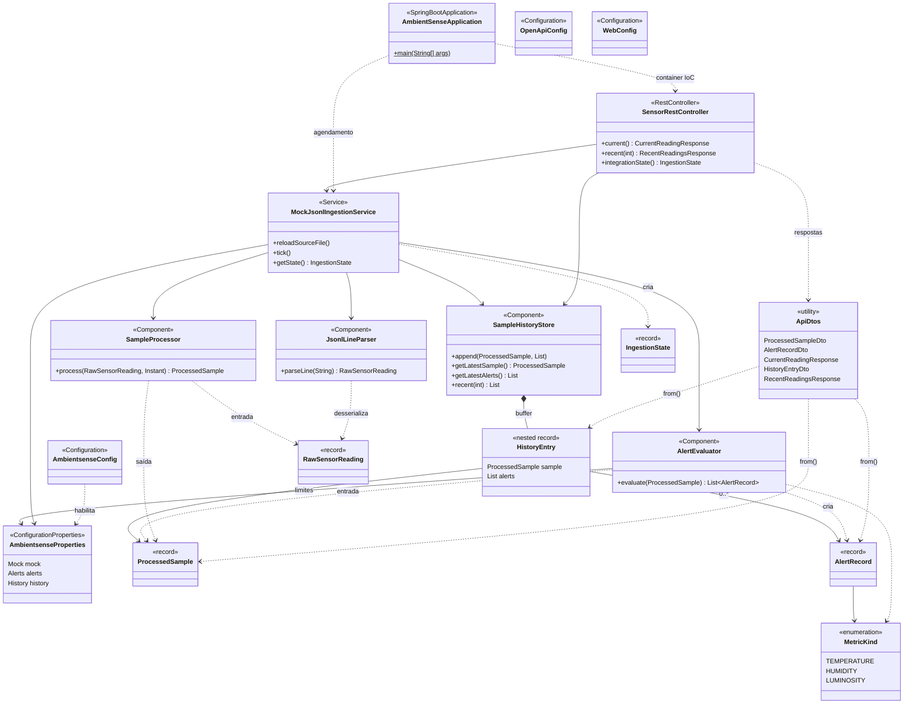

# Diagrama de classes UML — backend AmbientSense (MVP)

Visão dos principais componentes do backend Java, fluxo de ingestão mock (JSONL) e exposição REST. Relações de **dependência** (uso) e **composição** (histórico); DTOs de API espelham os registros de domínio na camada `web`.

Para visualizar: qualquer visualizador Markdown com suporte a Mermaid, ou copie o bloco abaixo para o [Mermaid Live Editor](https://mermaid.live) e exporte PNG/SVG.

