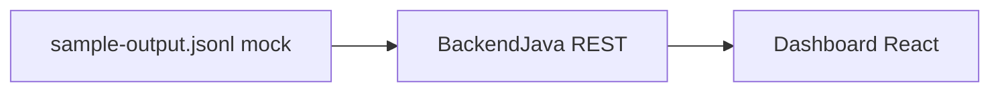

# Guia de desenvolvimento — AmbientSense

Este documento orienta a concepção e a implementação do projeto **AmbientSense**, um sistema acadêmico de monitoramento ambiental baseado em simulação de hardware e três camadas de software: simulação Arduino, backend em Java (expondo **API REST**) e um **dashboard em React** (**mobile-first**) que exibe as leituras dos sensores **atualizadas em tempo quase real**, obtidas **sempre via REST** (não há etapa separada de “protótipo visual”: o próprio dashboard é a interface de produto).

---

## 1. Visão geral do projeto

O **AmbientSense** tem como objetivo demonstrar um fluxo completo de dados de IoT: desde a “captura” de grandezas físicas até o **acompanhamento contínuo no dashboard React** (via API REST) e o disparo de alertas para o usuário final.

O sistema monitora três grandezas:

- **Temperatura**
- **Umidade** (modelada como percentual; no Tinkercad atual é **simulada** por potenciômetro — ver seção 6)
- **Luminosidade**

Em um cenário com hardware real, essas grandezas seriam lidas por sensores conectados a um microcontrolador (por exemplo, Arduino UNO). Neste projeto universitário, **não há hardware físico**: o comportamento do Arduino é **simulado**, tipicamente com ferramentas como o **Tinkercad Circuits**, reproduzindo o circuito e a lógica de leitura sem custo e sem dependência de laboratório.

A simulação substitui o hardware real ao gerar sequências de leituras coerentes com o comportamento esperado dos sensores (variação no tempo, faixas plausíveis e, se desejado, cenários de teste como picos ou falhas). Na arquitetura-alvo, esses dados alimentam o **backend Java**, que valida, processa e aplica regras (incluindo limites para alertas) e **expõe leituras e alertas por API REST**. O **dashboard em React** é o canal único de observação: **consulta a API em intervalos curtos** (ou mecanismo equivalente acordado, por exemplo *long polling* ou *WebSocket* numa evolução) para manter **grandezas e alertas atualizados em tempo quase real**, sem depender de mock ou de arquivo no navegador.

**MVP (definição deste guia):** a **origem** dos dados no servidor ainda não é o sensor físico nem a porta serial do Arduino: o backend usa **dados mockados**, lendo o arquivo [`backend-java/data/sample-output.jsonl`](../backend-java/data/sample-output.jsonl) **linha por linha**. O **dashboard React**, porém, **continua consumindo apenas a REST**: para o usuário, a experiência é a mesma ideia de monitoramento contínuo; **futuramente**, quando o backend passar a ingerir o hardware real (ou outra fonte ao vivo), **o mesmo dashboard** poderá exibir leituras verdadeiramente em tempo real via **os mesmos princípios de consumo REST** (*endpoints* estáveis, atualização frequente).

Em síntese, o escopo acadêmico compreende três subsistemas integrados: **simulação (referência; amostra fixa `sample-output.jsonl` no MVP)**, **processamento em Java com API REST** e **dashboard React mobile-first** voltado ao **monitoramento ao vivo dos dados do sensor** pela rede.

---

## 2. Requisitos funcionais

Os requisitos funcionais descrevem o que o sistema deve fazer, do ponto de vista do usuário e do fluxo de dados.

1. **Simulação de dados dos sensores** — O sistema deve produzir leituras periódicas de temperatura, umidade e luminosidade, de forma consistente com a modelagem adotada na simulação (Arduino/Tinkercad ou equivalente).

2. **Recebimento e processamento no backend** — O módulo Java deve aceitar os dados segundo o formato acordado (vide seção 8). **No MVP**, a entrada efetiva é o **mock por arquivo**: leitura sequencial de [`sample-output.jsonl`](../backend-java/data/sample-output.jsonl) (uma linha = uma leitura). Em seguida, aplicar processamento (validação, normalização, cálculos auxiliares e avaliação de regras).

3. **Exposição via REST** — O backend deve **expor os dados processados e o estado dos alertas por HTTP (API REST)** em contrato estável (JSON), de forma que o **dashboard React** possa consumir *endpoints* documentados (por exemplo leitura atual, últimos *N* pontos ou *polling* acordado) **sem acoplamento ao arquivo ou ao simulador**.

4. **Dashboard em tempo quase real via REST** — O **dashboard React** deve exibir os valores atuais das grandezas do sensor (e tendências recentes) com **atualização frequente obtida exclusivamente da API REST** (*polling* ou outro padrão HTTP acordado), de modo a acompanhar o ritmo das novas leituras expostas pelo backend (no MVP, o ritmo reflete o avanço do mock; **na evolução com hardware**, o mesmo padrão sustenta leituras em tempo real).

5. **Alertas baseados em limites** — O sistema deve permitir definir limites (mínimos e/ou máximos) para uma ou mais grandezas e deve sinalizar ao usuário quando uma leitura ultrapassar esses limites (estado de alerta ativo).

6. **Rastreabilidade mínima** — Cada conjunto de leituras deve poder ser associado a um instante de tempo (carimbo temporal), de modo a ordenar eventos e correlacionar alertas com o momento da ocorrência.

*(Opcional para evolução do trabalho: persistência em banco ou arquivo para histórico prolongado — não é obrigatório para a definição mínima acima.)*

---

## 3. Requisitos não funcionais

### Desempenho

A simulação e o backend devem operar em **ritmo compatível com “tempo real didático”**: a cadência de novas leituras e o tempo de resposta da cadeia origem → backend → **dashboard** devem ser suficientes para o observador perceber **atualização contínua na UI** (via REST), sem atrasos que invalidem a demonstração (por exemplo, filas longas ou processamento bloqueante desnecessário).

### Usabilidade

O **dashboard React** deve ser **mobile-first**: layout legível em telas pequenas, toques com áreas adequadas, hierarquia visual clara entre valores instantâneos, gráficos e alertas. O usuário deve identificar rapidamente se há condição de alerta e quais grandezas estão fora da faixa.

### Manutenibilidade

A solução deve adotar **estrutura modular**: separação nítida entre simulação, serviços de domínio e apresentação; nomes e responsabilidades coerentes; facilitando ajustes de regras de alerta, formato de dados ou troca de canal de comunicação sem reescrever o sistema inteiro.

### Escalabilidade e evolução

O desenho deve permitir, em trabalhos futuros, **substituir a simulação ou o mock por hardware real** (por exemplo, leitura serial ou protocolos de IoT) e eventualmente aumentar o número de sensores ou nós, reutilizando o modelo de dados e a camada de processamento com adaptações pontuais — **sem obrigar novo dashboard**, desde que a REST permaneça compatível.

---

## 4. Arquitetura do sistema

A arquitetura segue um fluxo linear de dados entre três camadas principais.

### Fluxo de dados

**Referência de dados (firmware / Tinkercad)** gera o contrato JSON Lines; **no MVP**, a ingestão efetiva é **`sample-output.jsonl` (mock, linha por linha)** → **Módulo backend Java (processamento + API REST)** → **Cliente React (dashboard mobile-first)**.

### Responsabilidades por camada

| Camada | Responsabilidade principal |
|--------|---------------------------|
| Simulação | Emular o firmware e o circuito (Tinkercad / `.ino`): define o **contrato de leitura**; a **amostra reproduzível** do MVP está em `backend-java/data/sample-output.jsonl`. **No MVP**, não conecta ao backend em tempo real; o Java **reproduz** esse fluxo lendo o arquivo linha a linha. |
| Backend Java | *Parsing* (incluindo linhas inválidas); validar tipos e faixas; modelo de domínio; regras de negócio e limites de alerta; **API REST (JSON)** consumível pelo frontend. |
| Dashboard (React) | **Monitoramento** das grandezas do sensor em **tempo quase real**: cliente HTTP para a API REST, cartões de métricas, gráficos de série temporal e alertas; **mobile-first**. |

### Comunicação entre camadas

**MVP:** entre “origem” e Java, usar **somente** o mock baseado em arquivo: [`backend-java/data/sample-output.jsonl`](../backend-java/data/sample-output.jsonl), consumido **sequencialmente (uma linha por ciclo ou conforme cronômetro interno)**. Entre Java e o cliente, usar **REST sobre HTTP** (JSON), é o contrato oficial para o dashboard React.

Em evoluções futuras, a mesma **API REST** pode continuar sendo alimentada por serial, MQTT, ou arquivo gerado ao vivo — desde que o **modelo de domínio e o formato de leitura** (seção 8) permaneçam alinhados.

### Diagrama de alto nível



*Legenda MVP:* não há seta em tempo real do hardware; `jsonl` fixa o comportamento didático até haver ingestão física.

---

## 5. Estrutura sugerida de pastas

A organização abaixo facilita a separação de responsabilidades e a avaliação do projeto por componentes.

| Pasta | Propósito |
|-------|-----------|
| `docs/` | Documentação do projeto: este guia, decisões de arquitetura, formato de dados e, se houver, instruções de execução e diagramas. |
| `arduino-simulation/` | Artefatos da simulação: referência ao circuito Tinkercad, notas de pinagem, descrição do comportamento esperado dos sensores e qualquer script auxiliar usado para exportar ou encaminhar dados. |
| `backend-java/` | Projeto Java: modelos de dados, serviços de processamento, regras de alerta, **ingestão MVP** do [`sample-output.jsonl`](../backend-java/data/sample-output.jsonl), **API REST** e testes unitários quando aplicável. |
| `frontend/` (planejado) | **Dashboard React** (monitoramento ao vivo via REST): UI mobile-first, gráficos, estado dos alertas e cliente HTTP com cadência adequada ao tempo quase real. |

A pasta **`docs/`** concentra o conhecimento compartilhado pela equipe e pelos avaliadores. **`arduino-simulation/`** isola firmware e circuito de referência. **`backend-java/`** agrega o **mock MVP** (`data/sample-output.jsonl`, linha a linha), processamento, políticas (limites, alertas) e **superfície REST**. **`frontend/`** agrega o **dashboard React** de monitoramento, consumindo **apenas** a API HTTP.

---

## 6. Guia de implementação passo a passo

### Etapa 1 — Simulação do Arduino

- Implementar no ambiente de simulação a leitura periódica das três grandezas (conforme componentes virtuais disponíveis no Tinkercad ou modelo adotado).
- Definir a cadência de leitura e a forma de saída dos dados: **CSV** ou **JSON**, alinhados à seção 8.
- Garantir que cada registro inclua carimbo temporal e identificação mínima do “dispositivo” simulado, se necessário para o trabalho.

**Implementação atual neste repositório (Tinkercad):**

| Grandeza | Origem no simulador | Pino |
|----------|---------------------|------|
| Temperatura (°C) | Sensor **TMP36** (fórmula datasheet no firmware) | **A0** |
| Umidade (%) | **Potenciômetro** (mapeamento 0–1023 → 0–100%) | **A2** |
| Luminosidade | **Fototransistor** (ADC 0–1023 → campo `luminosity` 0–100) | **A1** |

- **Firmware:** [`arduino-simulation/AmbientSense.ino`](../arduino-simulation/AmbientSense.ino) — sem bibliotecas externas; saída **JSON Lines** (um objeto JSON válido por linha) no monitor serial **9600 baud**.
- **Cadência:** 1 leitura por segundo (`INTERVAL_MS = 1000`), configurável no sketch.
- **Detalhes de montagem e semântica dos campos:** [`arduino-simulation/README.md`](../arduino-simulation/README.md); exemplo de contrato: [`backend-java/data/sample-output.jsonl`](../backend-java/data/sample-output.jsonl).

A Etapa 2 deve tratar o **JSON desta origem** como contrato de entrada (parsing linha a linha ou ingestão equivalente).

### Etapa 2 — Backend em Java

- Criar o **modelo de dados** alinhado ao formato de entrada (entidades ou DTOs para leitura ambiental e alertas).
- Implementar o **parsing** robusto (tratamento de linhas inválidas, valores fora de tipo).
- Implementar a **ingestão MVP**: ler [`sample-output.jsonl`](../backend-java/data/sample-output.jsonl) **em ordem**, **uma linha por vez** (cada linha = um objeto JSON; ver seção 8), simulando a cadência real ou um intervalo configurável — **sem** conexão ao sensor físico.
- Implementar o **processamento**: validação de faixas, opcionalmente estatísticas simples, e avaliação de **regras de alerta** com base em limites configuráveis.
- **Expor API REST** (JSON): *endpoints* estáveis para o dashboard React obter leituras processadas, histórico recente e estado de alertas (detalhes exatos ficam para a especificação OpenAPI ou documentação da sprint).

### Etapa 3 — Camada de integração

- **MVP:** o “canal” simulador → Java é **fixo**: arquivo `sample-output.jsonl` + leitor sequencial no backend (ou serviço dedicado de mock interno).
- Documentar o fluxo (caminho do arquivo, encoding UTF-8, frequência de avanço de linha, comportamento ao fim do arquivo — ex.: reiniciar do início ou parar) para reprodutibilidade na apresentação acadêmica.
- Tratar falhas leves (linha vazia, JSON malformado, fim de arquivo) de forma previsível e logável.

**Implementação e documentação detalhada:** [`docs/integration-mvp-backend.md`](integration-mvp-backend.md).

**API REST do MVP (backend `backend-java/`):**

| Método | Caminho | Descrição |
|--------|---------|-----------|
| GET | `/api/v1/samples/current` | Última leitura processada + alertas da última avaliação |
| GET | `/api/v1/samples/recent?limit=64` | Histórico recente (leitura + alertas por item) |
| GET | `/api/v1/integration/state` | Estado do mock JSONL (caminho, linhas, EOF) |

Base URL padrão: `http://localhost:8080`.

### Etapa 4 — Dashboard em React

- Implementar o **dashboard** como aplicação React de produção (não como protótipo visual descartável): consumir **exclusivamente** a **API REST** do backend (sem ler o `.jsonl` no browser; o arquivo é responsabilidade do servidor/mock).
- Garantir **atualização contínua** dos dados exibidos (*polling* REST ou evolução acordada), alinhada ao objetivo de **tempo quase real** e à futura ligação com sensor físico.
- Construir telas com foco mobile: leitura atual das três grandezas em destaque.
- Adicionar **gráficos** de série temporal (eixo temporal vs. valor), com legenda e unidades.
- Implementar **alertas visuais**: estados distintos para “normal” vs. “alerta”, uso de cores e, se desejado, mensagens breves (*toasts* ou faixas de aviso) quando um limite for ultrapassado.

---

## 7. Diagrama UML (representação textual)

Diagrama de classes conceitual em forma textual (ASCII). Relações: um **EnvironmentalSample** agrega várias **SensorReading** (ou uma leitura por grandeza no mesmo instante); **SensorDataProcessor** utiliza **AlertRule** para produzir **Alert** quando necessário.

```
+----------------------+       +-------------------+
| EnvironmentalSample  |       |   SensorReading   |
+----------------------+       +-------------------+
| timestamp            |<>-----| sensorType        |
| deviceId (opcional)  |  *    | value             |
+----------------------+       | unit              |
         |                       +-------------------+
         |
         v
+----------------------+       +-------------------+
| SensorDataProcessor  |------>|    AlertRule      |
+----------------------+       +-------------------+
| evaluate(sample)     |       | metric            |
| processRules(...)    |       | minValue          |
+----------------------+       | maxValue          |
         |                       +-------------------+
         |
         v
+----------------------+
|       Alert          |
+----------------------+
| severity             |
| message              |
| triggeredAt          |
| relatedMetric        |
+----------------------+
```

**Relacionamentos em uma linha:** o processador recebe amostras ambientais, compara valores contra conjuntos de regras de alerta e instancia alertas quando os limites são violados.

---

## 8. Definição do formato de dados

### Formato principal recomendado: JSON

O formato **JSON** é recomendado como padrão de troca por ser legível, amplamente suportado em Java e em aplicações web, e por permitir evolução do schema com novos campos opcionais.

**MVP:** cada linha de [`sample-output.jsonl`](../backend-java/data/sample-output.jsonl) é um objeto com a mesma estrutura base descrita abaixo; o backend **ingere** esse fluxo; a **API REST** pode transformar ou enriquecer o payload (por exemplo agregar alertas ou histórico), mas deve permanecer **previsível para o dashboard React**.

Cada **objeto de leitura** ou **lote** deve incluir, no mínimo, os seguintes elementos conceituais:

| Campo | Descrição | Observação |
|-------|-----------|------------|
| `timestamp` | Instantâneo da medição | **Neste projeto (Etapa 1):** inteiro = `millis()` desde o boot do Arduino na sessão Tinkercad — ordena leituras na mesma execução. **Evolução:** na Etapa 3, o host ou o backend pode enriquecer com ISO 8601 (UTC) para relatórios. |
| `temperature` | Valor de temperatura | Unidade explícita: graus Celsius (°C). Origem atual: TMP36 em A0. |
| `humidity` | Umidade em percentual | Faixa conceitual 0–100%. Origem atual: potenciômetro em A2 (simulação didática). |
| `luminosity` | Luminosidade | **Decisão deste repositório:** percentual **0–100** (mapeamento linear do ADC 10 bits do fototransistor em A1). **Não** usar lux no pipeline atual. |
| `deviceId` | Identificador do nó simulado | Presente no firmware atual: string fixa `ambient-sense-01` (ajustável no `.ino`). |

**Exemplo de uma linha (JSON Lines), como emitido pelo monitor serial:**

```json
{"timestamp":9000,"temperature":24.71,"humidity":38.00,"luminosity":41,"deviceId":"ambient-sense-01"}
```

Quando várias leituras forem agrupadas, pode-se utilizar um envelope com campo de lista (por exemplo `readings`) contendo vários objetos com a mesma estrutura base.

### Formato alternativo: CSV

O **CSV** é adequado para exportação simples, planilhas e depuração. Recomenda-se:

- Linha de cabeçalho com nomes de colunas fixos e na ordem definida no relatório do projeto.
- Colunas mínimas: `timestamp`, `temperature`, `humidity`, `luminosity`, e opcionalmente `deviceId`.
- Separador e codificação documentados (por exemplo vírgula e UTF-8).

### Consistência

Independentemente do formato, **uma única convenção de unidades** para luminosidade e **uma única interpretação** de `timestamp` (até migração para ISO 8601 na integração) evitam erros no backend e nos gráficos. Alterações no contrato devem ser refletidas neste guia ou em um changelog em `docs/`.

---

*Guia do AmbientSense. Contrato da Etapa 1 e unidades acima refletem o circuito Tinkercad e o firmware em `arduino-simulation/`.*

**MVP:** ingestão mock por [`sample-output.jsonl`](../backend-java/data/sample-output.jsonl) (linha a linha); backend expõe **REST** (`/api/v1/...`, ver tabela na Etapa 3); **dashboard React** consome a API para exibir dados em **tempo quase real**. Sem integração ao sensor físico nesta fase na origem do backend — a evolução manterá o mesmo padrão **dashboard ↔ REST**. Detalhes operacionais: [`integration-mvp-backend.md`](integration-mvp-backend.md).
