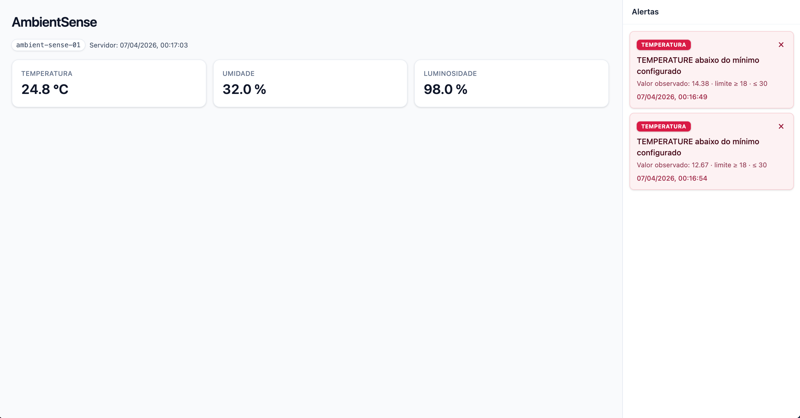
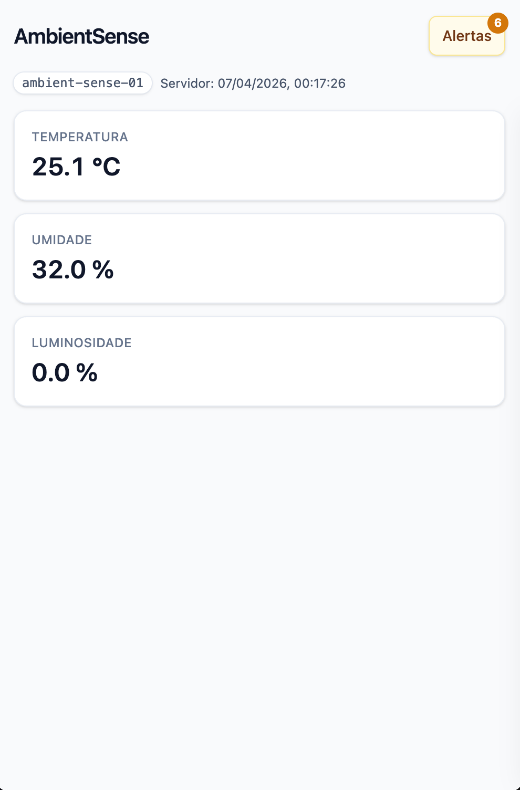
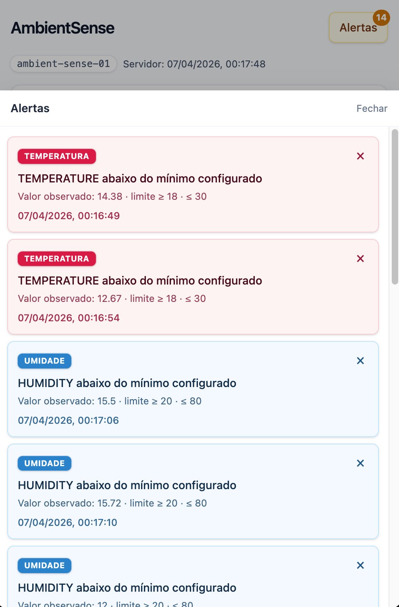

  

## Disciplina

**Projeto Integrador V-B**

 

A Pontifícia Universidade Católica de Goiás apresenta o(s) estudante(s) abaixo relacionados, vinculados à Escola Politécnica e de Artes, ao curso **Tecnologia em Análise e Desenv. de Sistemas**,

 

**Aluno:** Weverton Ferreira Rodrigues

  

**Título do trabalho:** _AmbientSense — monitoramento ambiental com simulação Arduino, backend Java e dashboard React_

 

Local: Goiânia · Data: abril de 2026

## 1. Esquema ilustrativo do protótipo Arduino

### 1.1 Circuito (Tinkercad)

Montagem no **Tinkercad Circuits** (Arduino UNO): leituras periódicas de temperatura, luminosidade e umidade simulada; saída serial **9600 baud**, **uma linha JSON por amostra**, compatível com o backend.

**Tinkercad:** [abrir projeto](https://www.tinkercad.com/things/lfiohLBSa4p/editel?sharecode=jKGgcwwvcxqq1QzCjqgA1COrARxw3ZG_sm_vPxTTyZs)

### 1.2 Componentes

| Componente     | Função                       | Pino      |
| -------------- | ---------------------------- | --------- |
| TMP36          | Temperatura (°C)             | A0        |
| Fototransistor | Luminosidade 0–100%          | A1        |
| Potenciômetro  | Umidade simulada (%)         | A2        |
| Arduino UNO    | `analogRead`, JSON, `Serial` | 5 V / GND |

TMP36: `°C = (V − 0,5) × 100` (5 V, ADC 10 bits). Umidade é **simulada** no protótipo para cenários de teste.

### 1.3 Firmware

O sketch `.ino` lê A0–A2, formata JSON (`timestamp`, `temperature`, `humidity`, `luminosity`, `deviceId`) e envia a cada 1 s.

**Código-fonte no repositório:** [arduino-simulation](https://github.com/wevertoum/AmbientSense/tree/master/arduino-simulation) (arquivo `AmbientSense.ino`).

## 2. Módulo em Java (Spring Boot — MVP)

API REST que ingere **JSON Lines** (mock da cadência serial), valida amostras, aplica **limites** configuráveis e devolve leitura atual, histórico e estado do mock. Principais pacotes: `config`, `model`, `service`, `web`.

**Código-fonte (produção + `resources`):** [backend-java/src/main](https://github.com/wevertoum/AmbientSense/tree/master/backend-java/src/main)

Testes em `backend-java/src/test/java`. Documentação de integração: `docs/integration-mvp-backend.md`.

### 2.1 Diagrama de classes (UML)

Versão **exportada** do diagrama (SVG): **[`diagram_ambientsense_uml.svg`](diagram_ambientsense_uml.svg)** — figura abaixo. A fonte editável em **Mermaid** está em **[`diagram_uml.md`](diagram_uml.md)**;

## 3. Protótipo de interface visual (React — MVP)

MVP em **React** consome `GET /api/v1/samples/current` (e histórico quando necessário), exibe cartões de temperatura, umidade e luminosidade, `deviceId`, horário do servidor e **alertas** conforme limites do backend. **Desktop:** coluna de alertas ao lado. **Mobile:** botão “Alertas” com contagem e **drawer** com detalhes (métrica, mensagem, valores e limites).

**Código:** [frontend-react](https://github.com/wevertoum/AmbientSense/tree/master/frontend-react) no GitHub. _(Mockup Figma/QuantUX: inserir link se houver.)_

### Capturas (telas reduzidas para o PDF)

<strong>Desktop</strong> — métricas e alertas

<table style="margin: 0.2em auto; border: 0; border-collapse: collapse;"><tr>
<td style="vertical-align: top; text-align: center; padding: 0 0.35em;">

<strong>Mobile</strong> — principal

</td>
<td style="vertical-align: top; text-align: center; padding: 0 0.35em;">

<strong>Mobile</strong> — alertas

</td>
</tr></table>

### Funcionalidades

| Item     | Descrição                                                             |
| -------- | --------------------------------------------------------------------- |
| Dados    | Atualização periódica; última amostra processada.                     |
| Métricas | °C, % umidade, % luminosidade.                                        |
| Contexto | `deviceId` e referência de tempo do servidor.                         |
| Alertas  | Fora dos limites configurados; dismiss e listagem no drawer (mobile). |

### Referências rápidas

`README.md` (visão geral), `docs/integration-mvp-backend.md` (mock JSONL e API), `docs/diagram_uml.md` (UML em Mermaid), `docs/diagram_ambientsense_uml.svg` (UML exportado), `backend-java/README.md` (contratos JSON).
